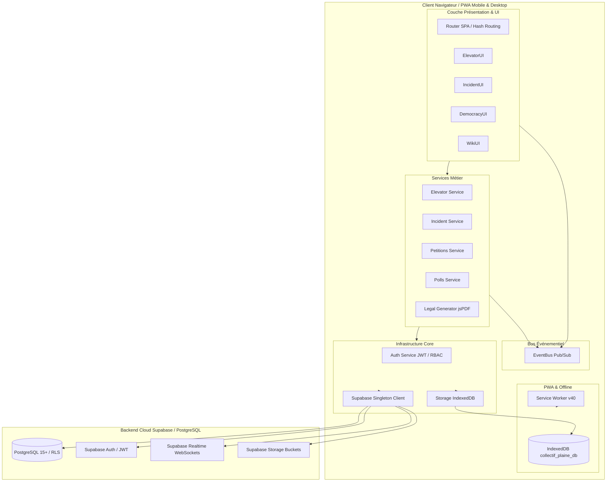

# Architecture Technique — Collectif Plaine (Standards 2026)

Ce document décrit l'architecture logicielle, le modèle de données, les politiques de sécurité Zero-Trust et les flux d'exécution de l'application **Collectif Plaine**.

---

## 1. Principes Directeurs de Conception

1. **Zero-Trust Security (Standards 2026) :** Toutes les opérations d'écriture et de lecture sensible reposent sur des jetons JWT validés par Supabase Auth et des politiques **Row-Level Security (RLS)** côté PostgreSQL. Aucun état côté client ne confère de droits.
2. **Modularité ES6 Native :** Découplage strict entre la couche Core (Infrastructure/Storage/Auth), les Domaines Métier (Elevators/Incidents/Democracy/Wiki/Legal) et les Contrôleurs UI.
3. **Architecture Événementielle (Event-Driven) :** Un bus d'événements asynchrone (`EventBus`) découple les mises à jour de données et les rafraîchissements d'interface.
4. **PWA Offline-First & Résilience :** Le stockage local est géré via **IndexedDB** (`collectif_plaine_db`), éliminant les limitations de 5 Mo du `localStorage`. Les actions hors-ligne sont mises en file d'attente (`sync_queue`) et synchronisées automatiquement dès le retour du réseau.
5. **Précision Métier :** Le calcul de l'indisponibilité des ascenseurs est effectué à la minute près (`downtimeHours`) en analysant chronologiquement les pannes et remises en service.

---

## 2. Diagramme d'Architecture Globale

---

## 3. Schéma de Base de Données (PostgreSQL)

### 3.1. Table `public.residents`
Stocke les profils des utilisateurs résidents et leur niveau de privilège.
- `id` (`uuid`, PRIMARY KEY, REFERENCES `auth.users(id)` ON DELETE CASCADE)
- `username` (`text`, UNIQUE, NOT NULL)
- `first_name` (`text`)
- `last_name` (`text`)
- `entrance` (`text`) — Numéro d'entrée du bâtiment (38 à 76)
- `apartment` (`text`) — Numéro d'appartement
- `phone` (`text`) — Coordonnées privées protégées
- `email` (`text`) — Coordonnées privées protégées
- `notifications` (`boolean`, DEFAULT `false`)
- `role` (`text`, NOT NULL, DEFAULT `'resident'`, CHECK `IN ('resident', 'admin')`)
- `created_at` (`timestamp with time zone`, DEFAULT `now()`)

### 3.2. Table `public.elevators`
Représente l'état courant des ascenseurs pour chaque entrée.
- `id` (`text`, PRIMARY KEY) — Numéro de l'entrée (ex: `"38"`, `"50"`, `"76"`)
- `status` (`text`, CHECK `IN ('en_service', 'en_panne')`)
- `last_status_change` (`timestamp with time zone`, DEFAULT `now()`)
- `maintenance_notes` (`text`)

### 3.3. Table `public.reports`
Historique de tous les signalements de pannes créés par les résidents.
- `id` (`text`, PRIMARY KEY)
- `entrance` (`text`, NOT NULL)
- `type` (`text`, NOT NULL) — Ex: `"arrêt"`, `"bruit"`, `"porte"`
- `description` (`text`)
- `user_display` (`text`)
- `user_id` (`uuid`, REFERENCES `auth.users(id)` ON DELETE SET NULL)
- `photo_url` (`text`)
- `created_at` (`timestamp with time zone`, DEFAULT `now()`)

### 3.4. Table `public.histories`
Journal d'audit des changements de statut et interventions sur les ascenseurs.
- `id` (`text`, PRIMARY KEY)
- `entrance` (`text`, NOT NULL)
- `status` (`text`, NOT NULL)
- `notes` (`text`)
- `created_at` (`timestamp with time zone`, DEFAULT `now()`)

### 3.5. Table `public.incidents`
Registre des incidents affectant les parties communes de la résidence.
- `id` (`text`, PRIMARY KEY)
- `entrance` (`text`, NOT NULL)
- `category` (`text`, NOT NULL) — Ex: `"proprete"`, `"securite"`, `"chauffage"`, `"eclairage"`
- `description` (`text`, NOT NULL)
- `status` (`text`, DEFAULT `'ouvert'`, CHECK `IN ('ouvert', 'en_cours', 'resolu')`)
- `user_display` (`text`)
- `created_by` (`uuid`, REFERENCES `auth.users(id)` ON DELETE SET NULL)
- `photo_url` (`text`)
- `created_at` (`timestamp with time zone`, DEFAULT `now()`)

### 3.6. Tables de Démocratie Participative
- **`public.petitions` :** `id` (uuid PK), `title` (text), `description` (text), `target_signatures` (integer), `status` (text), `created_by` (uuid), `created_at` (timestamptz).
- **`public.petition_signatures` :** `id` (uuid PK), `petition_id` (uuid FK), `resident_id` (uuid FK), `created_at` (timestamptz) — Contrainte d'unicité `(petition_id, resident_id)`.
- **`public.polls` :** `id` (uuid PK), `title` (text), `description` (text), `type` (text), `options` (jsonb), `status` (text), `created_by` (uuid), `ends_at` (timestamptz), `created_at` (timestamptz).
- **`public.poll_votes` :** `id` (uuid PK), `poll_id` (uuid FK), `resident_id` (uuid FK), `option_index` (integer), `selected_option` (text), `created_at` (timestamptz) — Contrainte d'unicité `(poll_id, resident_id)`.

---

## 4. Matrice des Politiques de Sécurité (Row-Level Security)

| Table | `SELECT` | `INSERT` | `UPDATE` | `DELETE` |
| :--- | :--- | :--- | :--- | :--- |
| **`residents`** | Utilisateurs connectés (`authenticated`) | Déclencheur système Auth | Propriétaire ou Admin | Propriétaire ou Admin |
| **`elevators`** | Public (`public`) | Administrateur (`admin`) | Utilisateurs connectés | Administrateur (`admin`) |
| **`reports`** | Public (`public`) | Utilisateurs connectés | Non autorisé | Auteur (`user_id`) ou Admin |
| **`incidents`** | Public (`public`) | Utilisateurs connectés | Auteur (`created_by`) ou Admin | Auteur (`created_by`) ou Admin |
| **`petitions`** | Public (`public`) | Administrateur (`admin`) | Administrateur (`admin`) | Administrateur (`admin`) |
| **`petition_signatures`** | Public (`public`) | Propriétaire (`resident_id`) | Non autorisé | Administrateur (`admin`) |
| **`polls`** | Public (`public`) | Administrateur (`admin`) | Administrateur (`admin`) | Administrateur (`admin`) |
| **`poll_votes`** | Public (`public`) | Propriétaire (`resident_id`) | Non autorisé | Administrateur (`admin`) |

---

## 5. Couches Logicielles & Modules

### 5.1. Couche Core (`js/core/`)
- **`db-client.js` :** Singleton initialisant le client `@supabase/supabase-js` local.
- **`auth.js` :** Gestion des sessions via Supabase Auth, écouteur d'état `onAuthStateChange`, récupération du profil et vérification de rôle RBAC (`isAdmin()`).
- **`storage.js` :** Wrapper `IndexedDB` gérant 3 magasins d'objets :
  - `sync_queue` : Actions hors-ligne en attente de synchronisation.
  - `photos_cache` : Blobs d'images compressées pour signalements hors-ligne.
  - `app_cache` : Cache des états applicatifs.
- **`event-bus.js` :** Bus Pub/Sub d'événements (`EVENTS.ELEVATORS_UPDATED`, `EVENTS.AUTH_STATE_CHANGED`, etc.).
- **`router.js` :** Routage SPA par hash d'URL (`#/ascenseurs`, `#/incidents`, `#/petitions`, `#/stats`, etc.) avec protection de l'onglet admin.

### 5.2. Couche Domaines (`js/domains/`)
- **`elevators/` :** Calculs précis des heures d'arrêt (`downtimeHours`), abonnement Realtime Supabase, grille des 76 entrées et graphiques d'indisponibilité.
- **`incidents/` :** Gestion des signalements, upload Supabase Storage, filtrage par catégorie et visionneuse de photos sécurisée.
- **`democracy/` :** Gestion des pétitions citoyennes avec jauges d'avancement et des scrutins à vote unique avec pourcentages en temps réel.
- **`wiki/` :** Base documentaire juridique basée sur les décrets et la loi du 6 juillet 1989 avec moteur de recherche textuel.
- **`legal/` :** Générateur de documents PDF officiels (mises en demeure LRAR, historiques d'incidents, listes de signatures certifiées) via `jsPDF`.

### 5.3. Couche Utilitaires (`js/utils/`)
- **`security.js` :** `sanitizeHTML()` anti-XSS, validation d'identifiants et compression d'images côté client (Canvas API).
- **`date-helpers.js` :** Calculateur de temps relatif (`timeAgo`) et formatage de dates en français.
- **`audio-feedback.js` :** Retours sonores discrets via Web Audio API.
